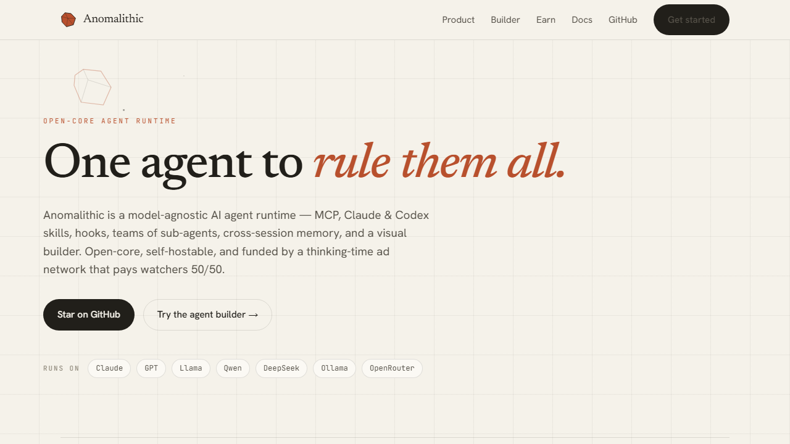
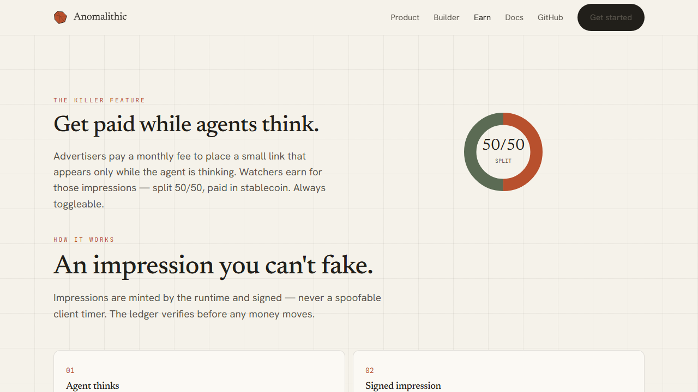
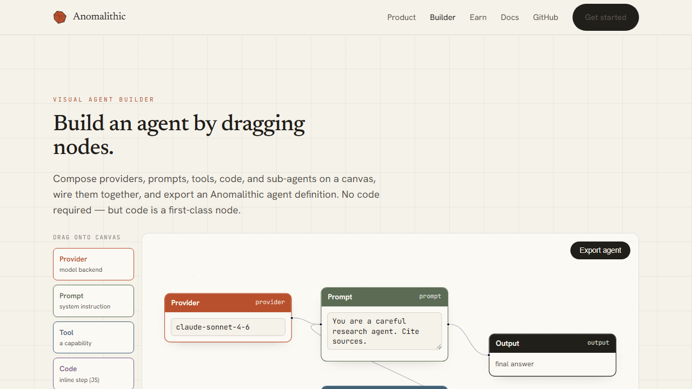
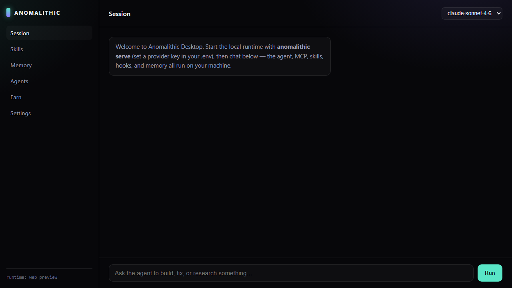

<div align="center">

# ⬛ Anomalithic

### One open-core, model-agnostic agent runtime to rule them all.

[**Live site →**](https://anomalithic.vercel.app) &nbsp;·&nbsp; [Architecture](./ARCHITECTURE.md) &nbsp;·&nbsp; [Roadmap](./ROADMAP.md) &nbsp;·&nbsp; [Ad spec](./docs/specs/thinking-impressions.md)

[](https://github.com/zanni098/Anomalithic/actions/workflows/ci.yml)


<a href="https://anomalithic.vercel.app"></a>

</div>

---

Anomalithic is an AI agent runtime designed to match the capability of tools like
Claude Code while staying **provider-agnostic** and **self-hostable**. It runs for
minutes or days, spawns teams of sub-agents, speaks MCP, loads **Claude *and* Codex
skills**, fires lifecycle hooks, remembers across sessions — and funds itself with a
thinking-time ad network that pays watchers **50/50** in stablecoin.

The name is *anomaly* + *-lithic* (stone / monolith): the one monolithic agent.

## ✦ The killer feature — get paid while agents think



Advertisers pay a monthly fee to place a small link + short blurb that appears
**only while the agent is thinking**. Watchers earn for those impressions, split
**50/50** between the platform and the watcher, paid in **USDC on Base**. Always
toggleable.

The trust anchor already ships: every thinking window mints a **runtime-signed
impression** (`packages/core/src/impression.ts`) that the ad ledger verifies before
crediting a watcher — impressions can only be minted by the runtime, never spoofed by
a client timer. See the frozen [impression spec](./docs/specs/thinking-impressions.md).

## ✦ Build agents visually — drag, drop, wire, export

<a href="https://anomalithic.vercel.app/builder"></a>

Compose providers, prompts, tools, code, and sub-agents on a canvas, wire them
together, and export an Anomalithic agent definition — **[try it live](https://anomalithic.vercel.app/builder)**. No code required, but code is a first-class node.

## ✦ The whole agent, not a wrapper

Ten focused, open-source packages compose into one capable agent — each tested,
typed, and small enough to read in a sitting.

| Package | What it does |
|---|---|
| `@anomalithic/providers` | Any model — Anthropic, OpenAI, OpenRouter, Ollama, or any OpenAI-compatible endpoint |
| `@anomalithic/core` | Agent loop, typed event bus, **signed thinking-impressions**, tool registry |
| `@anomalithic/mcp` | Model Context Protocol stdio client + tool adapter |
| `@anomalithic/skills` | Loads Claude `SKILL.md` **and** Codex `AGENTS.md` into one skill system |
| `@anomalithic/hooks` | Lifecycle hooks: SessionStart, Pre/PostToolUse, Stop, Thinking |
| `@anomalithic/orchestrator` | Durable task store, atomic checkout, dependency graph, budgets — run for hours/days |
| `@anomalithic/memory` | File-backed cross-session memory + recall |
| `@anomalithic/security` | Secret redaction, permission policy, path sandbox, audit log |
| `@anomalithic/os` | The agentic-OS **kernel** that composes every package into one runtime |
| `@anomalithic/cli` | The `anomalithic` CLI — `run`, `skills`, `memory`, `mcp` |

The product, running — a quiet ad shows only during the thinking window, and each
window mints one signed impression:

```console
$ anomalithic run -p google "explain MCP in one sentence" --ads
✦ thinking…
💡 Your ad here while agents think — https://anomalithic.vercel.app/ads
MCP (Model Context Protocol) is an open standard that lets AI agents
call external tools and data sources over a uniform JSON-RPC interface.
[google:gemini-2.5-flash] 1 turn(s), 12+8 tokens, 1 impression(s)

$ anomalithic serve -p mock
Anomalithic serve · http://127.0.0.1:4517 · mock:mock

$ curl -s http://127.0.0.1:4517/health
{"ok":true,"provider":"mock","model":"mock"}
```

## ✦ Quickstart

```bash
pnpm install
pnpm build

# Offline demo (no API key needed):
node packages/cli/dist/index.js run -p mock "hello"

# Real model — copy .env.example to .env and add a key:
cp .env.example .env            # set ANTHROPIC_API_KEY or OPENAI_API_KEY
node packages/cli/dist/index.js run "explain MCP in one sentence"

# Point at any OpenAI-compatible endpoint (OpenRouter, Ollama, local):
ANOMALITHIC_PROVIDER=openai OPENAI_BASE_URL=http://localhost:11434/v1 \
  node packages/cli/dist/index.js run -m llama3.1 "hi"
```

## ✦ Desktop app



Native shell ([`apps/desktop`](./apps/desktop)) — chat with the agent, switch models, browse memory and skills. The UI calls the local `anomalithic serve` runtime so **everything runs on your machine**.  A [release pipeline](./.github/workflows/release.yml) builds `.msi` / `.dmg` / `.deb` / AppImage on every tag.

## ✦ Platforms

- **CLI + TUI** — `anomalithic run`, `chat`, full-screen `tui`, `serve` (local HTTP runtime API), plus `skills` / `memory` / `mcp` / `plugins` / `sessions`
- **Desktop app** — Tauri shell with dark UI; runtime sidecar via `anomalithic serve`; release pipeline builds native installers
- **Messaging gateway** — Telegram, Slack, Discord adapters (WhatsApp / Signal roadmap)
- **Mobile** — _(later)_

See the full plan in [ROADMAP.md](./ROADMAP.md).

## ✦ Develop

```bash
pnpm build        # build all packages (turbo)
pnpm test         # run all tests (vitest) — 11 suites
pnpm typecheck    # tsc --noEmit across the workspace
pnpm lint         # biome check
```

The website lives in [`apps/web`](./apps/web) (Next.js, deployed to Vercel).

## ✦ License

**Open-core.** The runtime packages and the desktop shell are Apache-2.0
(see [LICENSE](./LICENSE)); the hosted ad marketplace, payout wallet, and advertiser
portal are proprietary. Details in [LICENSING.md](./LICENSING.md).

<div align="center">
<sub>Built in the open · <a href="https://anomalithic.vercel.app">anomalithic.vercel.app</a></sub>
</div>
